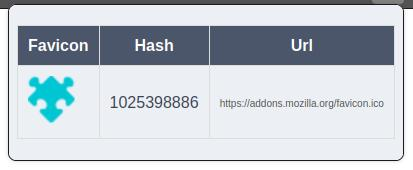

# Favicon Hash for Shodan (Firefox Extension)
This extension calculates the [MurmurHash3](https://en.wikipedia.org/wiki/MurmurHash) hash of an active tab's favicon and displays the result in a popup, suitable for searches on the [Shodan Search Engine](https://shodan.io). It provides a clickable link to Shodan search results:

```bash
https://www.shodan.io/search?query=http.favicon.hash:<hash_value>
```
## Installation

Install directly from [Mozzila Add-on Store](https://addons.mozilla.org/en-GB/firefox/addon/favicon-hash-for-shodan/).

## Screenshot


